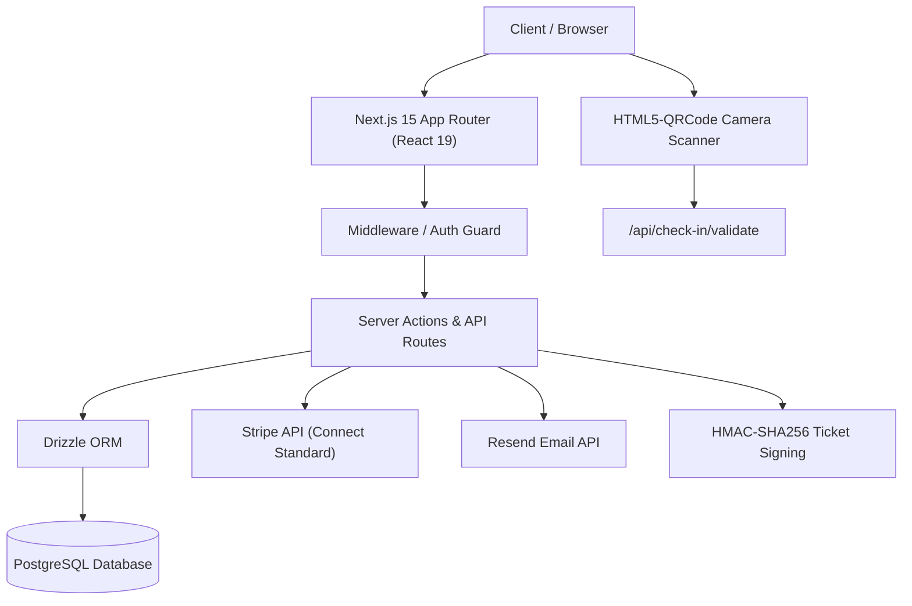
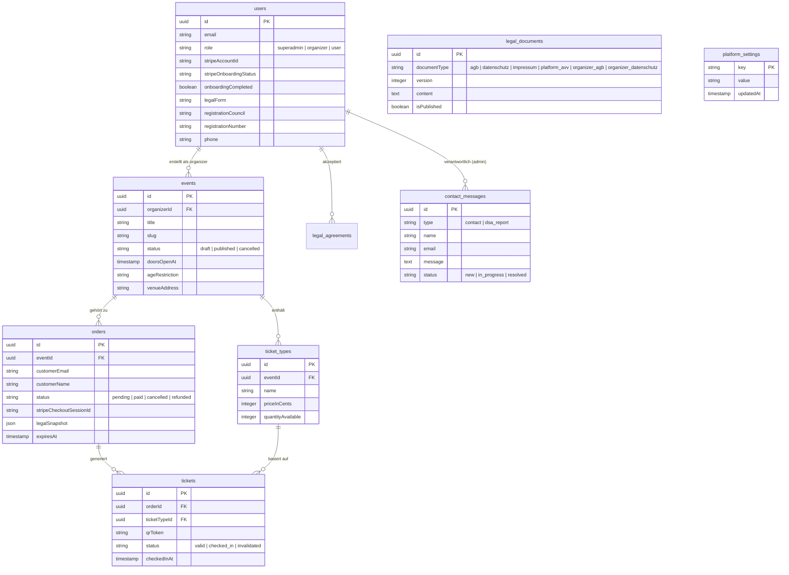

# GateMate – Systemarchitektur & Technische Dokumentation

## 1. Übersicht & Systemarchitektur

**GateMate** ist eine Fullstack-Ticketing-Plattform für Veranstalter und Event-Teilnehmer. Die Anwendung kombiniert ein modernes Next.js 15 App-Router-Frontend mit einer typsicheren PostgreSQL-Datenbank (via Drizzle ORM), Stripe Connect Standard für Zahlungsabwicklung, Better-Auth für Authentifizierung & Session-Management, Resend für E-Mail-Kommunikation sowie ein Browser-basiertes Check-in-System mit QR-Code-Scanning.

---

## 2. Technologie-Stack

| Schicht | Technologie / Library | Beschreibung |
| :--- | :--- | :--- |
| **Framework** | Next.js 15.1.3 (App Router) & React 19 | Server Component & Server Action Architektur |
| **Styling** | Tailwind CSS v3 & Radix UI | Komponentenbibliothek mit responsivem Design |
| **Datenbank** | PostgreSQL & Drizzle ORM (v0.38) | Typsichere Schema-Definitionen & SQL-Migrationen |
| **Authentifizierung** | Better-Auth (v1.1) | Session-basierte Authentifizierung mit Rollenverwaltung (`superadmin`, `organizer`, `user`) |
| **Zahlungen** | Stripe Connect Standard | Direct Seller Payment Architecture mit automatischen Split-Gebühren |
| **E-Mails** | Resend SDK (v6.30) | Transaktionale Ticketbestätigungen & Passwort-Resets |
| **Scanner & QR** | HTML5-QRCode & ZXing Library | Browserbasierter QR-Scanner mit Kamera-Freigabe |
| **Typisierung** | TypeScript (v5.7) & Zod (v3.24) | End-to-End Typsicherheit & Laufzeit-Validierung |

---

## 3. Datenbank-Architektur (Drizzle ORM Schema)

Die Datenbankstruktur in [`src/db/schema/`](file:///home/Tulle/antigravity/delightful-newton/src/db/schema) besteht aus folgenden Kern-Tabellen:

---

## 4. Middleware & Routen-Schutz

Die Middleware in [`src/middleware.ts`](file:///home/Tulle/antigravity/delightful-newton/src/middleware.ts) sichert das Anwendungssystem ab:

1. **Rollenbasierte Zugriffskontrolle (RBAC):**
   - `/admin/*`: Nur für Benutzer mit Rolle `superadmin` zugänglich.
   - Superadmins werden bei Zugriff auf `/organizer/*` automatisch nach `/admin` umgeleitet.
   - `/organizer/*`: Für Veranstalter (`organizer`) zugänglich. Unberechtigte Nutzer werden auf `/login` umgeleitet.
2. **Erzwungenes Onboarding (Multi-Step Onboarding Guard):**
   - Veranstalter, die `onboardingCompleted: false` aufweisen, werden automatisch zu `/onboarding` umgeleitet, sobald sie versuchen, Dashboard-Funktionen zu nutzen.
3. **Öffentliche Routen (Public Unprotected):**
   - Startseite (`/`), Event-Seiten (`/e/[eventSlug]`), Rechtstexte (`/impressum`, `/datenschutz`, `/agb`, `/avv`), Kontakt (`/kontakt`), DSA (`/notice-and-action`), Ticket-Widget (`/embed/[eventId]`) und Auth-Seiten (`/login`, `/register`).
4. **Statische Assets & PWA-Manifest:**
   - Der Middleware-Matcher schließt Web-Manifeste (`site.webmanifest`), Favicons und statische Bildformate (`.svg`, `.png`, `.jpg`, `.ico`, `.webp`) gezielt von der Ausführung aus, um Overhead zu vermeiden.

---

## 5. Cron-Jobs & Webhook-Struktur

### 5.1 Stripe Webhook Handler (`/api/webhooks/stripe`)
- Empfängt Event-Benachrichtigungen von Stripe (z. B. `checkout.session.completed`, `checkout.session.expired`).
- Bei `checkout.session.completed`: Markiert Bestellung als `paid`, generiert signierte QR-Tickets und sendet Ticket-Mail via Resend.
- Bei `checkout.session.expired`: Storniert die temporäre Bestellung und gibt die reservierten Ticket-Kontingente wieder frei.

### 5.2 Order Auto-Cleanup Cron Endpoint (`/api/cron/cleanup-orders`)
- Kann per Cron-Scheduler aufgerufen werden.
- Identifiziert offene Bestellungen (`status: 'pending'`), deren Ablaufzeit (`expiresAt`) überschritten ist.
- Gibt reservierte Ticket-Kontingente in `ticket_types` frei und setzt den Order-Status auf `cancelled`.

---

## 6. Umgebungsvariablen & Konfiguration

Die wesentlichen Konfigurationsvariablen in [`.env.example`](file:///home/Tulle/antigravity/delightful-newton/.env.example):
- `DATABASE_URL`: PostgreSQL-Verbindungs-URL.
- `BETTER_AUTH_SECRET` & `BETTER_AUTH_URL`: Authentifizierungsschlüssel und Base-URL.
- `STRIPE_SECRET_KEY`, `STRIPE_WEBHOOK_SECRET`, `NEXT_PUBLIC_STRIPE_PUBLISHABLE_KEY`: Stripe API Schlüssel.
- `STRIPE_PLATFORM_FEE_PERCENT`: Standard- / Fallback-Gebührensatz (Standard: `5.0`), falls noch kein Wert in `platform_settings` konfiguriert wurde. Die aktive Steuerung erfolgt live über das Superadmin-Dashboard (`/admin`).
- `QR_SIGNING_SECRET`: Kryptografischer Schlüssel (HMAC-SHA256) für fälschungssichere QR-Code Ticket-Tokens.
- `RESEND_API_KEY` & `EMAIL_FROM`: Resend E-Mail Integration.
- `ADMIN_EMAIL` & `ADMIN_PASSWORD`: Automatisches Bootstrapping des ersten Superadmin-Accounts beim Serverstart.
