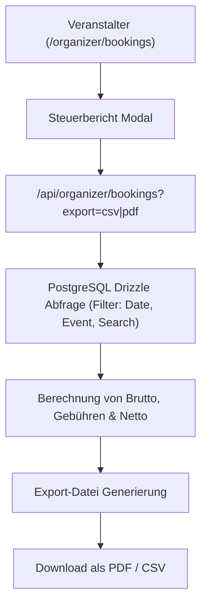

# Modul-Dokumentation: Buchungsverwaltung & Finanzamt-Export

## 1. Übersicht

Veranstalter benötigen eine transparente Übersicht aller Ticketverkäufe sowie steuerlich konforme Berichte für die Buchhaltung und das Finanzamt. Das Modul **Buchungsverwaltung** (`/organizer/bookings`) bietet detaillierte Filter- und Exportfunktionen.

---

## 2. Buchungsverwaltung UI & Filter (`/organizer/bookings`)

Das Dashboard ermöglicht Veranstaltern die Sicht auf alle bezahlten und stornierten Transaktionen.

### Filterkriterien:
- **Datumsbereich (von / bis):** Einschränkung nach Kaufdatum.
- **Event-Auswahl:** Filterung nach einem bestimmten Event oder allen Events.
- **Suchfeld:** Freitextsuche nach Käufername, E-Mail-Adresse oder Bestell-ID.

---

## 3. Finanzamt & Steuerberichte (CSV & PDF Export)

Über die Export-Funktion ([`src/components/dashboard/tax-report-modal.tsx`](file:///home/Tulle/antigravity/delightful-newton/src/components/dashboard/tax-report-modal.tsx)) können Berichte im CSV- oder PDF-Format generiert werden.

### Bestandteile des Finanzamt-Reports:
1. **Zusammenfassung der Einnahmen:**
   - Gesammelte Bruttoeinnahmen (Gesamtumsatz)
   - Abgezogene Plattformgebühren (dynamisch über `platform_settings` bzw. `getPlatformFeePercent()`, mit Fallback auf `STRIPE_PLATFORM_FEE_PERCENT`)
   - Ausgezahlter Nettoerlös an den Veranstalter
2. **Aufschlüsselung nach Event & Ticketkategorien:**
   - Anzahl verkaufter Tickets pro Kategorie
   - Einzelpreis und Gesamtbetrag pro Kategorie
3. **Auflistung der Einzeltransaktionen:**
   - Bestelldatum, Transaktions-ID, Käuferdaten, Zahlungsstatus, Betrag.

---

## 4. Relevante Dateien

- **Booking Page:** [`src/app/(dashboard)/organizer/bookings/page.tsx`](file:///home/Tulle/antigravity/delightful-newton/src/app/(dashboard)/organizer/bookings/page.tsx)
- **Booking Client Component:** [`src/components/dashboard/bookings-client.tsx`](file:///home/Tulle/antigravity/delightful-newton/src/components/dashboard/bookings-client.tsx)
- **Tax Report Export Modal:** [`src/components/dashboard/tax-report-modal.tsx`](file:///home/Tulle/antigravity/delightful-newton/src/components/dashboard/tax-report-modal.tsx)
- **API Endpoint:** [`src/app/api/organizer/bookings/route.ts`](file:///home/Tulle/antigravity/delightful-newton/src/app/api/organizer/bookings/route.ts)
