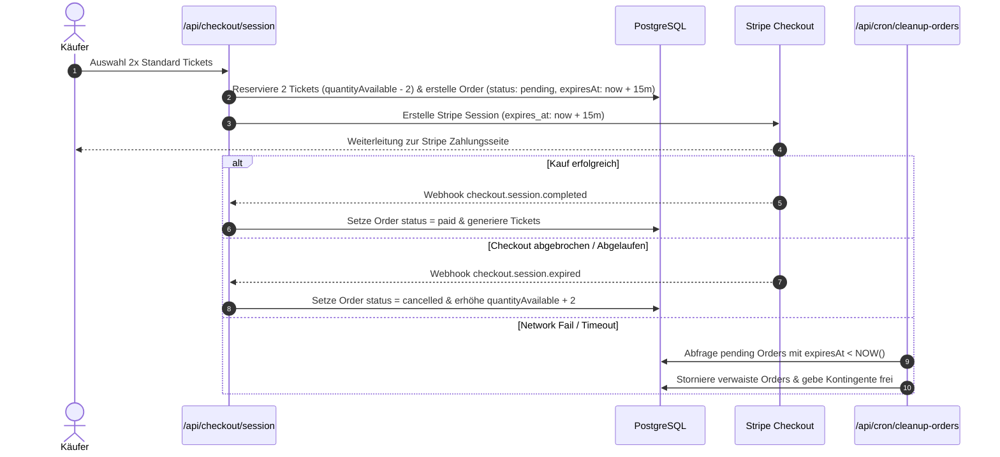

# Modul-Dokumentation: Ticket-Reservierungen & Session Expiration

## 1. Übersicht

Um Überbuchungen (Overselling) bei begehrten Events zu vermeiden, reserviert GateMate bereits bei Initiierung eines Stripe Checkouts das entsprechende Ticket-Kontingent für 15 Minuten. Wird der Kauf nicht abgeschlossen, schützt ein automatisiertes Expiration- & Cleanup-System vor blockierten Kontingenten.

---

## 2. Der Reservierungs-Lebenszyklus

1. **Kontingent-Reservierung:**
   - Bei Aufruf von [`/api/checkout/session`](file:///home/Tulle/antigravity/delightful-newton/src/app/api/checkout/session/route.ts) prüft der Server, ob ausreichend Tickets verfügbar sind (`quantityAvailable >= req.quantity`).
   - Die verfügbare Menge wird in einer atomaren Datenbanktransaktion verringert.
   - Eine Bestellung mit Status `pending` und Ablaufzeit `expiresAt = NOW() + 15 Minuten` wird angelegt.

2. **Checkout Session Expiration:**
   - Die Stripe Checkout Session wird mit derselben Ablaufzeit initialisiert.
   - Wenn der Benutzer die Seite schließt oder das Zeitfenster verstreicht, löst Stripe das Event `checkout.session.expired` aus.

3. **Integritätsschutz via Order Cleanup Cron:**
   - Falls Webhooks aufgrund von Netzwerkstörungen nicht zugestellt werden, stellt der Cronjob-Endpunkt [`/api/cron/cleanup-orders`](file:///home/Tulle/antigravity/delightful-newton/src/app/api/cron/cleanup-orders/route.ts) sicher, dass abgelaufene Reservierungen regelmäßig aufgeräumt werden.

---

## 3. Relevante Dateien

- **Checkout Session API:** [`src/app/api/checkout/session/route.ts`](file:///home/Tulle/antigravity/delightful-newton/src/app/api/checkout/session/route.ts)
- **Stripe Webhook Handler:** [`src/app/api/webhooks/stripe/route.ts`](file:///home/Tulle/antigravity/delightful-newton/src/app/api/webhooks/stripe/route.ts)
- **Order Cleanup Helper:** [`src/lib/orders-cleanup.ts`](file:///home/Tulle/antigravity/delightful-newton/src/lib/orders-cleanup.ts)
- **Cron Route:** [`src/app/api/cron/cleanup-orders/route.ts`](file:///home/Tulle/antigravity/delightful-newton/src/app/api/cron/cleanup-orders/route.ts)
