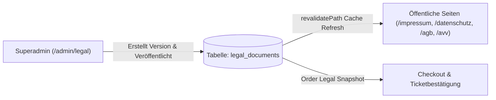

# Modul-Dokumentation: Recht & Compliance System

## 1. Übersicht

GateMate erfüllt umfassende europäische und deutsche Rechtspflichten (DSGVO, DSA, TDDDG/DDG, BGB, EGBGB). Das Plattformsystem trennt strikt zwischen **Plattform-Rechtstexten** (Betreiber der Plattform) und **Veranstalter-Rechtstexten** (Direktverkäufer der Tickets).

---

## 2. Rechtstext-Managementsystem (`legal_documents`)

Über die Admin-Schnittstelle (`/admin/legal`) können Administratoren Versionen globaler Rechtstexte verwalten, editieren und veröffentlichen.

### Unterstützte Dokumententypen (`legal_document_type` Enum):
1. `impressum`: Impressum der Plattform gemäß § 5 DDG (ehem. TMG).
2. `datenschutz`: Datenschutzerklärung gemäß Art. 13/14 DSGVO.
3. `agb`: Plattform-AGB für Nutzung der Dienste.
4. `platform_avv`: Auftragsverarbeitungsvertrag gemäß Art. 28 DSGVO zwischen Plattform und Veranstalter.
5. `organizer_agb`: Muster-AGB für Veranstalter gegenüber Ticketkäufern.
6. `organizer_datenschutz`: Muster-Datenschutzerklärung für Veranstalter.

---

## 3. Direct Seller Compliance (§ 305 BGB & Art. 246a EGBGB)

Da der Veranstalter der Vertragspartner des Ticketkäufers ist (Direktverkauf), stellt GateMate folgende Rechtssicherheiten im Checkout bereit:

1. **Rechtliche Einbindung vor Kaufabschluss (§ 305 BGB):**
   - Vor Absenden der Zahlung muss der Käufer den AGB des Veranstalters sowie den Datenschutzbestimmungen zustimmen.
2. **Order Legal Snapshots:**
   - Zum Zeitpunkt des Kaufs speichert die Bestellung (`orders.legalSnapshot`) den exakten Wortlaut und die Versionen der zum Kaufzeitpunkt gültigen Rechtstexte ab. Dadurch bleibt der Vertragsstand fälschungssicher dokumentiert.
3. **E-Mail-Pflichtangaben (Art. 246a EGBGB):**
   - Transaktions-E-Mails enthalten die vollständigen Kontaktdaten und Impressumsangaben des jeweiligen Veranstalters.

---

## 4. Digital Services Act (DSA) Compliance

GateMate setzt die Vorgaben des europäischen Digital Services Act (DSA) um:

- **Art. 30/31 DSA (KYTC - Know Your Business Customer):**
  - Erfassung und Validierung von Rechtsform, Registergericht, Handelsregisternummer und Kontaktdaten aller gewerblichen Veranstalter im Onboarding.
- **Notice & Action Meldesystem (`/notice-and-action`):**
  - Formular zur Ausbringung von Rechtsverletzungsmeldungen (z. B. Urheberrecht, illegale Inhalte).
  - Weiterleitung und Speicherung im Admin-Posteingang (`/admin/messages`).

---

## 5. Relevante Dateien

- **Admin Rechtstext-Verwaltung:** [`src/app/(dashboard)/admin/legal/page.tsx`](file:///home/Tulle/antigravity/delightful-newton/src/app/(dashboard)/admin/legal/page.tsx)
- **Rechtstext Server Library:** [`src/lib/legal-server.ts`](file:///home/Tulle/antigravity/delightful-newton/src/lib/legal-server.ts) & [`src/lib/legal.ts`](file:///home/Tulle/antigravity/delightful-newton/src/lib/legal.ts)
- **Öffentliche Rechtstext-Routen:** [`src/app/(public)/agb/page.tsx`](file:///home/Tulle/antigravity/delightful-newton/src/app/(public)/agb/page.tsx), [`avv/page.tsx`](file:///home/Tulle/antigravity/delightful-newton/src/app/(public)/avv/page.tsx), [`datenschutz/page.tsx`](file:///home/Tulle/antigravity/delightful-newton/src/app/(public)/datenschutz/page.tsx), [`impressum/page.tsx`](file:///home/Tulle/antigravity/delightful-newton/src/app/(public)/impressum/page.tsx)
- **DSA Notice & Action Formular:** [`src/components/public/dsa-report-form.tsx`](file:///home/Tulle/antigravity/delightful-newton/src/components/public/dsa-report-form.tsx)
- **Datenbankschema:** [`src/db/schema/legal-documents.ts`](file:///home/Tulle/antigravity/delightful-newton/src/db/schema/legal-documents.ts)
