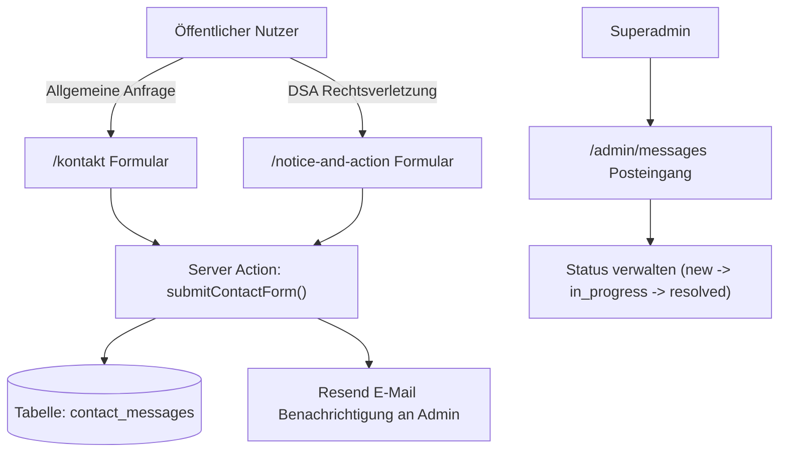

# Modul-Dokumentation: Kontakt- & DSA Inbox System

## 1. Übersicht

Das Nachrichten- und Meldesystem bündelt Anfragen aus dem allgemeinen Kontaktformular (`/kontakt`) und rechtsrelevanten Meldungen aus dem DSA Notice & Action Formular (`/notice-and-action`).

---

## 2. Eingangskanäle

### 2.1 Kontaktformular (`/kontakt`)
- **Ziel:** Allgemeiner Kundensupport, technische Anfragen oder Plattform-Feedback.
- **Formular-Felder:** Name, E-Mail-Adresse, Betreff, Nachricht.
- **Verarbeitung:** Erstellung eines Eintrags in `contact_messages` vom Typ `contact`.

### 2.2 DSA Notice & Action Formular (`/notice-and-action`)
- **Ziel:** Strukturierte Einreichung von Meldungen bezüglich rechtswidriger Inhalte gemäß Art. 16 Digital Services Act.
- **Formular-Felder:** Name, E-Mail, Typ der Rechtsverletzung (z. B. Urheberrecht, Betrug, Datenschutz), URL des betreffenden Events, ausführliche Begründung.
- **Verarbeitung:** Erstellung eines Eintrags in `contact_messages` vom Typ `dsa_report`.

---

## 3. Admin Nachrichten-Posteingang (`/admin/messages`)

Im Admin-Dashboard steht ein zentraler Posteingang bereit:

- **Filter nach Nachrichtentyp:** Alle, Kontaktanfragen, DSA-Meldungen.
- **Filter nach Status:** `new` (Neu), `in_progress` (In Bearbeitung), `resolved` (Erledigt).
- **Detail-Ansicht & Workflow:** Einsehen von Einreichungszeitpunkt, Kontakt- und Event-URLs sowie Möglichkeit zur Statusanpassung.

---

## 4. Relevante Dateien

- **Kontakt-Formular:** [`src/components/public/contact-form.tsx`](file:///home/Tulle/antigravity/delightful-newton/src/components/public/contact-form.tsx)
- **DSA Formular:** [`src/components/public/dsa-report-form.tsx`](file:///home/Tulle/antigravity/delightful-newton/src/components/public/dsa-report-form.tsx)
- **Server Action:** [`src/app/actions/contact.ts`](file:///home/Tulle/antigravity/delightful-newton/src/app/actions/contact.ts)
- **Admin Inbox View:** [`src/app/(dashboard)/admin/messages/page.tsx`](file:///home/Tulle/antigravity/delightful-newton/src/app/(dashboard)/admin/messages/page.tsx)
- **Admin Messages Component:** [`src/components/dashboard/admin-messages-client.tsx`](file:///home/Tulle/antigravity/delightful-newton/src/components/dashboard/admin-messages-client.tsx)
- **Datenbankschema:** [`src/db/schema/contact-messages.ts`](file:///home/Tulle/antigravity/delightful-newton/src/db/schema/contact-messages.ts)
