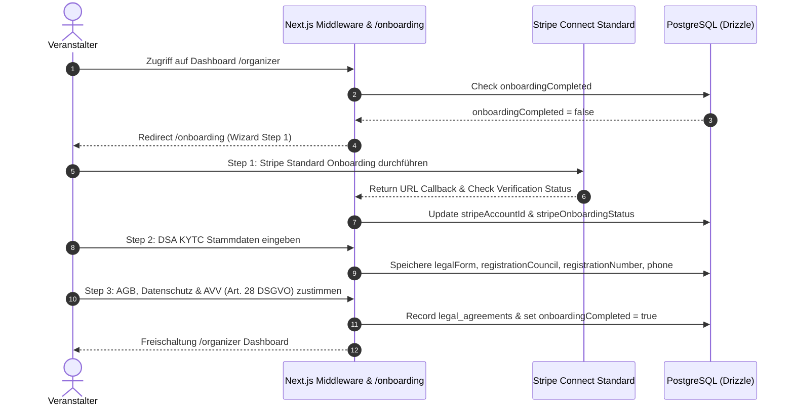

# Modul-Dokumentation: Multi-Step Veranstalter Onboarding

## 1. Übersicht

Das Onboarding-System stellt sicher, dass Veranstalter vor der Erstellung und Veröffentlichung von Events alle gesetzlich und operativ erforderlichen Daten hinterlegen und Verträge akzeptieren. Der Prozess ist als erzwungener 3-Schritt-Assistent aufgebaut (`/onboarding`).

---

## 2. Die 3 Onboarding-Schritte

### Schritt 1: Stripe Connect Standard Verknüpfung
- **Zweck:** Einrichtung des Zahlungskontos für direkte Auszahlungen (Destination Charges auf Standard-Konto).
- **API Endpoint:** [`/api/onboarding/step-1-stripe`](file:///home/Tulle/antigravity/delightful-newton/src/app/api/onboarding/step-1-stripe/route.ts)
- **Ablauf:** Generierung eines Stripe Connect Standard Account Links. Nach Rückkehr wird der Status auf `active` / `completed` abgefragt.

### Schritt 2: Rechtliche Stammdaten (DSA KYTC - Know Your Business Customer)
- **Zweck:** Erfüllung der Transparenzpflichten nach Art. 30/31 Digital Services Act (DSA).
- **API Endpoint:** [`/api/onboarding/step-2-legal`](file:///home/Tulle/antigravity/delightful-newton/src/app/api/onboarding/step-2-legal/route.ts)
- **Erfasste Felder:**
  - `legalForm`: Rechtsform (z. B. GmbH, Einzelunternehmen, GbR, Verein).
  - `registrationCouncil`: Registergericht (z. B. Amtsgericht München).
  - `registrationNumber`: Handelsregister- / Vereinsregisternummer (z. B. HRB 123456).
  - `phone`: Telefonnummer für geschäftliche Kontaktaufnahme.

### Schritt 3: Rechtstexte & Auftragsverarbeitungsvertrag (AVV)
- **Zweck:** Verbindliche Zustimmung zu den Plattform-AGB, der Datenschutzerklärung und dem AVV nach Art. 28 DSGVO.
- **API Endpoint:** [`/api/onboarding/step-3-terms`](file:///home/Tulle/antigravity/delightful-newton/src/app/api/onboarding/step-3-terms/route.ts)
- **Ablauf:** Eintragung in die Tabelle `legal_agreements` mit Zeitstempel und Versionsnummer. Nach Abschluss wird `onboardingCompleted` auf `true` gesetzt.

---

## 3. Relevante Dateien & Komponenten

- **Wizard UI-Komponente:** [`src/components/onboarding/onboarding-wizard.tsx`](file:///home/Tulle/antigravity/delightful-newton/src/components/onboarding/onboarding-wizard.tsx)
- **Onboarding Page:** [`src/app/onboarding/page.tsx`](file:///home/Tulle/antigravity/delightful-newton/src/app/onboarding/page.tsx)
- **Status API Endpoint:** [`src/app/api/onboarding/status/route.ts`](file:///home/Tulle/antigravity/delightful-newton/src/app/api/onboarding/status/route.ts)
- **Middleware Guard:** [`src/middleware.ts`](file:///home/Tulle/antigravity/delightful-newton/src/middleware.ts)
- **Schema-Erweiterungen:** [`src/db/schema/users.ts`](file:///home/Tulle/antigravity/delightful-newton/src/db/schema/users.ts)
