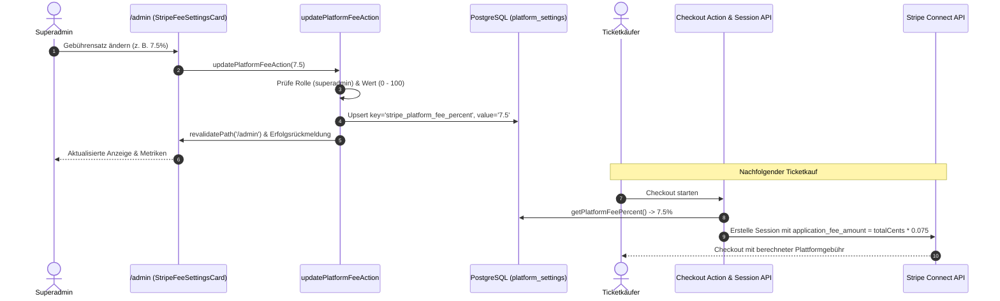

# Modul-Dokumentation: Dynamische Plattform-Einstellungen & Stripe-Gebührenverwaltung

## 1. Übersicht

Bisher war die Plattform-Gebühr für Ticketverkäufe statisch über Umgebungsvariablen (`STRIPE_PLATFORM_FEE_PERCENT`) vorgegeben. Eine Anpassung erforderte Änderungen an der Deployment-Konfiguration sowie einen Server-Neustart.

Mit dem Modul **Plattform-Einstellungen** (`platform_settings`) können Administratoren wesentliche Plattform-Parameter – insbesondere die prozentuale Stripe-Plattformgebühr (*application fee cut*) – im laufenden Betrieb direkt über das Superadmin-Dashboard (`/admin`) konfigurieren. Die Anpassungen sind sofort wirksam und fließen unmittelbar in alle nachfolgenden Checkout-Sessions und Plattform-Ertragsberechnungen ein.



---

## 2. Datenmodell (`platform_settings`)

Zur flexiblen Speicherung systemweiter Schlüssel-Wert-Konfigurationen wurde die Tabelle `platform_settings` via Drizzle ORM eingeführt:

```typescript
// src/db/schema/platform-settings.ts
export const platformSettings = pgTable("platform_settings", {
  key: text("key").primaryKey(),
  value: text("value").notNull(),
  updatedAt: timestamp("updated_at").defaultNow().notNull(),
});
```

### Konfigurationsschlüssel:
- `stripe_platform_fee_percent`: Prozentualer Abzug von Bruttoeinnahmen als Plattformgebühr (z. B. `"5.0"` für 5%).
- SQL-Migration: `drizzle/0014_early_angel.sql`.

---

## 3. Server Actions & Rollenberechtigungen

### 3.1 `updatePlatformFeeAction` (`src/app/actions/admin-settings-actions.ts`)
- **Berechtigung:** Strikt beschränkt auf Benutzer mit `gatemate_role === "superadmin"`.
- **Validierung:** Zahlwert zwischen `0` und `100`, Rundung auf maximal 2 Dezimalstellen.
- **Persistierung:** Drizzle `onConflictDoUpdate` für atomare Updates auf `platform_settings.key`.
- **Cache-Revalidierung:** Automatischer Aufruf von `revalidatePath("/admin")` für synchrone UI-Aktualisierung.

### 3.2 Helper `getPlatformFeePercent()` (`src/lib/platform-settings.ts`)
- Fragt den Eintrag `stripe_platform_fee_percent` aus der Datenbank ab.
- Fällt bei ungesetztem Wert oder Datenbankfehlern sicher auf den Umgebungsvariablen-Wert `process.env.STRIPE_PLATFORM_FEE_PERCENT` bzw. den Standardwert `5.0%` zurück.

---

## 4. UI-Komponente: `StripeFeeSettingsCard`

Die Client-Komponente [`src/components/dashboard/stripe-fee-settings-card.tsx`](file:///home/Tulle/antigravity/delightful-newton/src/components/dashboard/stripe-fee-settings-card.tsx) ist im oberen Bereich des Superadmin-Dashboards (`/admin`) platziert:

- **Statusanzeige:** Live-Anzeige der aktuellen Gebühr in Prozent.
- **Bearbeitungsmodus:** Umschalten in ein Eingabefeld (Schritte 0.1%, Min 0, Max 100).
- **Benutzerführung:** Ladeindikator beim Speichern, Fehlerbehandlung bei unzulässigen Eingaben und Abbruch-Option.
- **Dashboard-Metriken:** Die Kachel *Plattform-Einnahmen* in `/admin` berechnet den Gesamtertrag dynamisch anhand der aktuell konfigurierten Gebühr (`currentFeePercent`).

---

## 5. Integration im Checkout & Buchungsmodul

1. **Stripe Checkout Action & API:**
   - Sowohl [`src/app/actions/checkout-actions.ts`](file:///home/Tulle/antigravity/delightful-newton/src/app/actions/checkout-actions.ts) als auch [`src/app/api/checkout/session/route.ts`](file:///home/Tulle/antigravity/delightful-newton/src/app/api/checkout/session/route.ts) laden den aktuellen Satz via `getPlatformFeePercent()`.
   - Bei Destination Charges wird `application_fee_amount = Math.round(totalCents * (platformFeePercent / 100))` an die Stripe Session übergeben.
2. **Environment Fallback:**
   - In `.env.example` dient `STRIPE_PLATFORM_FEE_PERCENT` nur noch als Fallback, falls die Datenbanktabelle leer ist.

---

## 6. Relevante Dateien

- **Datenbankschema:** [`src/db/schema/platform-settings.ts`](file:///home/Tulle/antigravity/delightful-newton/src/db/schema/platform-settings.ts)
- **Settings Helper:** [`src/lib/platform-settings.ts`](file:///home/Tulle/antigravity/delightful-newton/src/lib/platform-settings.ts)
- **Admin Server Action:** [`src/app/actions/admin-settings-actions.ts`](file:///home/Tulle/antigravity/delightful-newton/src/app/actions/admin-settings-actions.ts)
- **UI-Komponente:** [`src/components/dashboard/stripe-fee-settings-card.tsx`](file:///home/Tulle/antigravity/delightful-newton/src/components/dashboard/stripe-fee-settings-card.tsx)
- **Superadmin Dashboard:** [`src/app/(dashboard)/admin/page.tsx`](file:///home/Tulle/antigravity/delightful-newton/src/app/(dashboard)/admin/page.tsx)
- **Checkout Integration:** [`src/app/actions/checkout-actions.ts`](file:///home/Tulle/antigravity/delightful-newton/src/app/actions/checkout-actions.ts) & [`src/app/api/checkout/session/route.ts`](file:///home/Tulle/antigravity/delightful-newton/src/app/api/checkout/session/route.ts)
